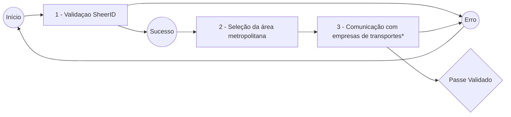

# Bem-vindo ao Projeto "Validar Passe"

A Ideia...

> #### "Este projeto visa criar uma ligação entre o SheerID e as empresas responsáveis pelos Transportes em Portugal, em apenas 2 passos, com o propósito de oferecer a (re)validação de passes(sub-23) a todos os estudantes."

### [Abrir Site de Demo](https://t4zzlerdeveloper.github.io/validarpasse/)

# Funcionamento

#### Esquema de estados da página

### 1 - Validaçao SheerID

Inicialmente recorremos à API da SheerID e criamos a nossa própria interface, mas inesperadamente obtemos alguns erros não documentados pela empresa e acabámos por integrar no nosso site o "embed" deles com um Custom CSS programado por nós (visível no fim da documentação).

### 2 - Seleção da área metropolitana

Aqui o utilizador pode selecionar as 2 áreas metropolitanas disponíveis em Portugal.

### 3 - Comunicação com empresas de transportes
Infelizmente, esta fase do programa não foi implementada, visto que requer negociação com as empresas responsáveis pelas Redes de Transportes Metropolitanos de Portugal.

# Todo:
- Criar pedidos com a API da SheerID de forma a garantir sempre autentição por parte do utilizador

- Integrar projeto com as Redes de Transportes Metropolitanos Portugueses

- Adicionar opção de carregamento de passes( Neste momento existe a aplicação móvel PickHub que já consegue fazer carregamentos de alguns passes, a nossa ideia seria dinamizar isso e criar tudo num site, simples de usar e sem burocracias. Acreditamos que o ideal seria criar uma parceria entre a PickHub, as Redes Metropolitanas e o nosso projeto.)

## Outros

#### Aqui está o nosso interface de validação de estudante inicial, no qual gostaríamos de investir mais para proceder à sua implementação, sem qualquer erro.

Nota: Adicionamos, tanto o código fonte com a build
