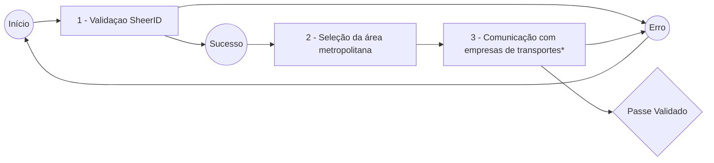

# Bem-vindo ao Projeto Validar Passe

A Ideia...

> #### "Este projeto visa criar uma ligação entre o SheerID e as empresas responsáveis, em apenas 2 passos, com o propósito de oferecer a (re)validação de passes(sub-23) a todos os estudantes."

**[Abrir site de Demo](https://validarpasse.pt)**

# Funcionamento

#### Esquema de estados da página

### 1 - Validaçao SheerID

Inicialmente recorremos à API da SheerID e criamos a nossa própria interface, mas inesperadamente obtemos alguns erros não documentados pela empresa e acabámos por integrar no nosso site o "iframe" deles com custom css (visível no fim da documentação).

### 2 - Seleção da área metropolitana

Aqui o utilizador pode selecionar as 2 áreas metropolitanas disponíveis em Portugal.

### 3 - Comunicação com empresas de transportes
*Infelizmente, esta fase do programa não foi implementada, visto que requer negociação com as empresas responsáveis pelas redes de transportes metropolitanos de Portugal.

# Todo:
- Criar pedidos com a API da SheerID de forma a garantir sempre autentição por parte do utilizador

- Integrar projeto com as redes metropolitanas portuguesas

- Adicionar opção de carregamento de passes

#
